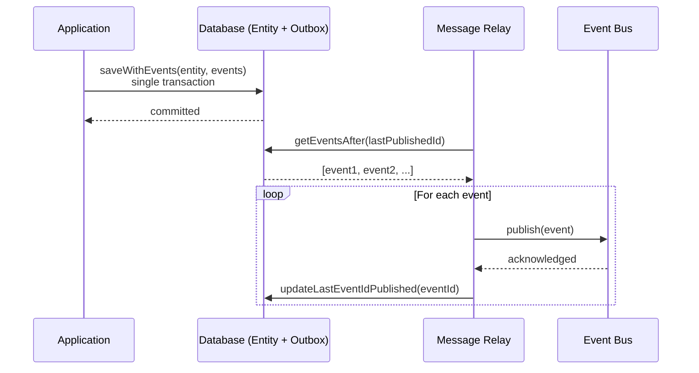

# Message Relay

The **Message Relay** is the bridge between your outbox table and your event bus. Its job is to read domain events that were persisted by the [repository](./repository.md#saving-entities-and-events-together) and forward them to the rest of your system via the [event bus](./event-bus.md).

It is designed to be **fault-tolerant**: it tracks exactly which events have been published so that, after a crash or restart, it picks up precisely where it left off — no events skipped, however events maybe be published twice.

---

## The Outbox pattern

The **Outbox pattern** solves a fundamental problem in distributed systems: how do you guarantee that a domain event is both persisted to your database _and_ delivered to the message broker, even if one of them fails?

The naive approach consist to save the entity, then publish the event. But it has a gap: if the process crashes after the save but before the publish, the event is lost forever. Doing it in the other order has the same problem in reverse.

The outbox pattern closes this gap by writing the event to the **same database transaction** as the entity state change. The event is stored in an "outbox" table first. Then a separate process (the Message Relay) reads from that table and forwards events to the broker. The two steps are decoupled, and each can be retried independently.



The key guarantee: if the relay crashes mid-batch, it restarts from the last checkpoint and re-publishes only the remaining events. The entity state in the database is never at risk.

---

## How it works

When triggered for a given entity, the relay runs the following sequence:

1. **Lock** the entity to prevent concurrent relay runs for the same entity
2. **Read** the last event ID that was successfully published for this entity
3. **Fetch** all events from the outbox that come after that checkpoint
4. For each event, **publish** it via the event bus, then **update** the checkpoint
5. **Unlock** the entity in all cases, even on failure

Because the checkpoint is updated after each individual event, a failure mid-batch means the relay will re-attempt from the last successfully published event on the next run — not from the beginning.

---

## Setup

The `MessageRelay` class takes four dependencies:

```typescript
import { MessageRelay } from "ontologic";

const relay = new MessageRelay(
  repository, // Repository — source of outbox events
  stateRepository, // MessageRelayStateRepository — tracks publishing progress
  "Order", // entityName — scopes the checkpoint to this entity type
  publisher, // DomainEventBusPublisher — delivers events to the bus
);
```

---

## Triggering the relay

The relay exposes a `handler` method that you call with an `entityId`. In the simplest setup where the relay runs in the same process as your application. You can wire it directly to the repository's `onChanges` callback:

```typescript
repository.onChanges(relay.handler);
```

This works well for prototyping and single-process deployments. In production however, **you may want to run the relay in a separate process** to isolate it from your application and scale it independently. In that case `onChanges` is no longer available, and you need another way to trigger the handler. Common approaches include:

- **Periodic polling** — run the relay on a cron schedule (e.g. every second), scanning for unpublished events across all entities
- **HTTP / gRPC** — your application calls an endpoint on the relay process after saving an entity
- etc...

The right choice depends on your latency requirements and infrastructure.

---

## Tracking publishing state

The relay depends on a `MessageRelayStateRepository` to persist its checkpoint. This repository must implement four operations:

```typescript
interface MessageRelayStateRepository {
  lock(params: { entityId: string; entityName: string }): Promise<void>;
  unlock(params: { entityId: string; entityName: string }): Promise<void>;
  getLastEventIdPublished(params: {
    entityId: string;
    entityName: string;
  }): Promise<string | undefined>;
  updateLastEventIdPublished(params: {
    eventId: string;
    entityId: string;
    entityName: string;
  }): Promise<void>;
}
```

The checkpoint is keyed by `(entityId, entityName)`, so a single state repository can safely track multiple entity types.

### In-memory implementation

For tests and local development, `ontologic` ships a ready-to-use in-memory implementation:

```typescript
import { InMemoryMessageRelayStateRepository } from "ontologic";

const stateRepository = new InMemoryMessageRelayStateRepository();
```

It stores state in a `Map` in memory. **Do not use it in production** state is lost on process restart.

### Production implementation

For production you must implement `MessageRelayStateRepository` backed by durable storage. The right choice depends on your stack:

| Storage        | Notes                                                                                  |
| -------------- | -------------------------------------------------------------------------------------- |
| **PostgreSQL** | Store state in a `message_relay_state` table; use `SELECT ... FOR UPDATE` for the lock |
| **Redis**      | Use a hash for state and `SET NX PX` for the distributed lock                          |
| **DynamoDB**   | Use a conditional write for the lock and a single item per `(entityName, entityId)`    |

If the relay runs in a separate process from your application, the state repository **must** be backed by shared external storage an in-process `Map` cannot be seen across process boundaries.

---

## Error handling

Errors thrown during publishing are emitted as `"error"` events on the relay. Wire up a handler before the relay starts processing:

```typescript
relay.onError((error) => {
  logger.error("message relay error", { error });
});
```

The `unlock` step always runs — even when an error occurs — so a failed relay run never leaves an entity permanently locked.

---

## Full example

```typescript
import {
  MessageRelay,
  InMemoryMessageRelayStateRepository,
  DomainEventBusPublisher,
  InMemoryConnectors,
} from "ontologic";

// Set up the event bus
const { publisherConnector } = InMemoryConnectors.create();
const publisher = new DomainEventBusPublisher<OrderEvents>({
  publisherConnector,
});
await publisher.start();

// Set up the relay
const stateRepository = new InMemoryMessageRelayStateRepository();
const relay = new MessageRelay(repository, stateRepository, "Order", publisher);

relay.onError((error) => {
  console.error("relay error", error);
});

// Trigger the relay whenever an entity changes
repository.onChanges(relay.handler.bind(relay));

// Now, saving an entity with events will automatically trigger the relay
const result = order.place({ items });
if (result.isOk()) {
  await repository.saveWithEvents(order, result.value);
  // onChanges fires → relay reads the new event → publishes it → updates checkpoint
}
```

---

## Summary

| Concern                          | Handled by                    |
| -------------------------------- | ----------------------------- |
| Reading events from the outbox   | `Repository.getEventsAfter`   |
| Delivering events to the bus     | `DomainEventBusPublisher`     |
| Tracking publishing progress     | `MessageRelayStateRepository` |
| Preventing concurrent relay runs | `lock` / `unlock`             |
| Recovering from failure          | Per-event checkpoint updates  |

The relay ensures that every event written to the outbox is eventually delivered — and that delivery survives failures without duplicating or losing events.
